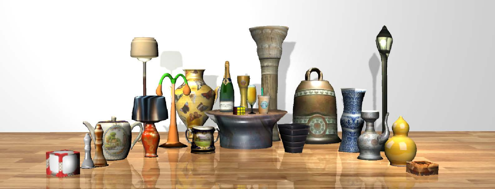

# AutoSweep: Recovering 3D Editable Objects from a Single Photograph
### [ProjectPage](https://chenxin.tech/AutoSweep.html) | [Paper](https://arxiv.org/abs/2005.13312) | [Video](xxxx) |  [Dataset](https://drive.google.com/file/d/1O62Tp-2pPncuKD8oKbkP_WZJcbj-f_ik/view?usp=sharing)
[Xin Chen](https://chenxin.tech/), [Yuwei Li](http://liyuwei.cc/), [Xi Luo](http://luoxi.tech/), [Tianjia Shao](http://tianjiashao.com/), [Jingyi Yu](http://vic.shanghaitech.edu.cn/vrvc/en/people/jingyi-yu/), [Kun Zhou](http://kunzhou.net/), [Youyi Zheng](http://youyizheng.net/).</br>


This repository contains the official implementation for the paper: [AutoSweep: Recovering 3D Editable Objects from a Single Photograph (TVCG 2018)](https://arxiv.org/abs/2005.13312). Our work
is capable of automatically generating 3D models from a single photograph which can then be used for editing and rearranging.<br>
<center class="half">
        
</center>
<br>

## Abstract
This paper presents a fully automatic framework for extracting editable 3D objects directly from a single photograph. Unlike previous methods which recover either depth maps, point clouds, or mesh surfaces, we aim to recover 3D objects with semantic parts and can be directly edited. We base our work on the assumption that most human-made objects are constituted by parts and these parts can be well represented by generalized primitives. Our work makes an attempt towards recovering two types of primitive-shaped objects, namely, generalized cuboids and generalized cylinders. To this end, we build a novel instance-aware segmentation network for accurate part separation. Our GeoNet outputs a set of smooth part-level masks labeled as profiles and bodies. Then in a key stage, we simultaneously identify profile-body relations and recover 3D parts by sweeping the recognized profile along their body contour and jointly optimize the geometry to align with the recovered masks. Qualitative and quantitative experiments show that our algorithm can recover high quality 3D models and outperforms existing methods in both instance segmentation and 3D reconstruction.

## Licenses
<a rel="license" href="http://creativecommons.org/licenses/by-nc-sa/4.0/"></a><br />This work is licensed under a <a rel="license" href="http://creativecommons.org/licenses/by-nc-sa/4.0/">Creative Commons Attribution-NonCommercial-ShareAlike 4.0 International License</a>.

All material is made available under [Creative Commons BY-NC-SA 4.0](https://creativecommons.org/licenses/by-nc-sa/4.0/legalcode) license. You can **use, redistribute, and adapt** the material for **non-commercial purposes**, as long as you give appropriate credit by **citing our paper** and **indicating any changes** that you've made.

## Quick Start
This is root folder for all parts of AutoSweep. There are several modules like below:

- AutoSweepMatl
	- **FasterRCNN**: we use deeplab for detection task at first. Finally, we use instances segmentation.  
	- **Deeplab**: we use deeplab for segementaion task at first. However, we find that this is not suit for instance task.
	- **[PointSetGeneration](https://github.com/fanhqme/PointSetGeneration)**：Code for "A Point Set Generation Network for 3D Object Reconstruction from a Single Image".
	- **[3D-R2N2](https://github.com/chrischoy/3D-R2N2)**:Single/multi view image(s) to voxel reconstruction using a recurrent neural network.
- AutoSweep
	- **FCIS**:we modify [fcis](https://github.com/msracver/FCIS) to be suit for AutoSweep dataset.
	- **MaskRCNN**:we modify [maskrcnn](https://github.com/TuSimple/mx-maskrcnn) to be suit for AutoSweep dataset.
	- **DCN**: Code from [Deformable Deconvolutional Network](https://github.com/msracver/Deformable-ConvNets).
	- **GeonetEnd2End**: This is a attempt for connectting FCIS and DCN.
	- **OneKeyGeonet**: We use this framework based on Matlab, to do experiments and demo.   
	- **AxisClassifier**: The property of curve or straight is estimated by this classifier.
	- **CircleReconstruction**: C++ version of Profile fitting.
	- **AnnatationTool**: The annatiation tool for AutoSweep dataset.
- Unity Part:
	- **ObjectSnap**: Modeling Part of AutoSweep Project based on Unity.

## Data Preparation
#### Download
You can download our dataset (2.8 GB) from [GoogleDrive](https://drive.google.com/file/d/1O62Tp-2pPncuKD8oKbkP_WZJcbj-f_ik/view?usp=sharing) or [Onedrive](https://1drv.ms/u/s!AsWCggO4PIEBnJ03gUFbEytQErI8Nw?e=f9Iwkl).

#### Annotation
Our dataset includes 11657 images with cubes and cylinders. The real dataset contains about 6000 unannotated images from ImageNet, 774 annotated images from Xiao et al., and 4883 images collected from the Internet. This dataset is further separated into 8183 training images and 3474 testing images. We use color to encode the instance and label information.
```
Red channel: {10,20,...} represents {instance 1, instance 2,...}.
Blue channel: zero represents body, nonzero represents top face.
Red channel: 150 represents grip, 200 represents cylinder, 255 represents cube.
```
Example is like below:
||||
|--- |--- |--- |
|Label|Color|instance ID|
|Cylinder - top face|(10, 10, 200)|1|
|Cylinder - top face|(20, 20, 200)|2|
|Cylinder - body|(10, 0, 200)|1|
|Cube - top face|(10, 10, 255)|1|
|Cube - body|(10, 0, 255)|1|
|Grip|(10, 0, 150)|1|

## Framework
The code consists of two modules, as mentioned in our paper, the learning module (image to mask) and the graphics module (mask to 3d mesh). The first module follows the framework of FCIS and Mask RCNN. A common learning framework with Python. The second module is built based on Unity3D and our own framework. The purpose of the second module is to sweep the profiles with a dynamic demo.

If you have any questions, feel free to ask (chenxin2@shanghaitech.edu.cn). Please refer to the code scripts for second module: 
```
AutoSweep_ObjectSnapping/Assets/BodyEngine.cs
AutoSweep_ObjectSnapping/Assets/FaceEngine.cs
AutoSweep_ObjectSnapping/Assets/GraphicsEngine.cs
```

## Citation
If you find our code or paper useful, please consider citing:
```
@article{xin2018autosweep,
  title={AutoSweep: Recovering 3D Editable Objects from a Single Photograph},
  author={Xin, Chen and Li, Yuwei and Luo, Xi and Shao, Tianjia and Yu, Jingyi and Zhou, Kun and Zheng, Youyi},
  journal={IEEE transactions on visualization and computer graphics},
  year={2018},
  publisher={IEEE}
}
```

## Relevant Works
[**3-Sweep: Extracting Editable Objects from a Single Photo (SIGGRAPH ASIA 2013)**](https://cg.cs.tsinghua.edu.cn/3sweep/)<br>
Tao Chen, Zhe Zhu, Ariel Shamir, Shi-Min Hu, Daniel Cohen-Or

[**Mask R-CNN (ICCV 2017)**](https://arxiv.org/abs/1703.06870)<br>
Kaiming He, Georgia Gkioxari, Piotr Dollár, Ross Girshick

[**TightCap: 3D Human Shape Capture with Clothing Tightness Field (TOG 2021)**](https://arxiv.org/abs/1904.02601)<br>
Xin Chen, Anqi Pang, Peihao Wang, Yang Wei, Lan Xui, Jingyi Yu